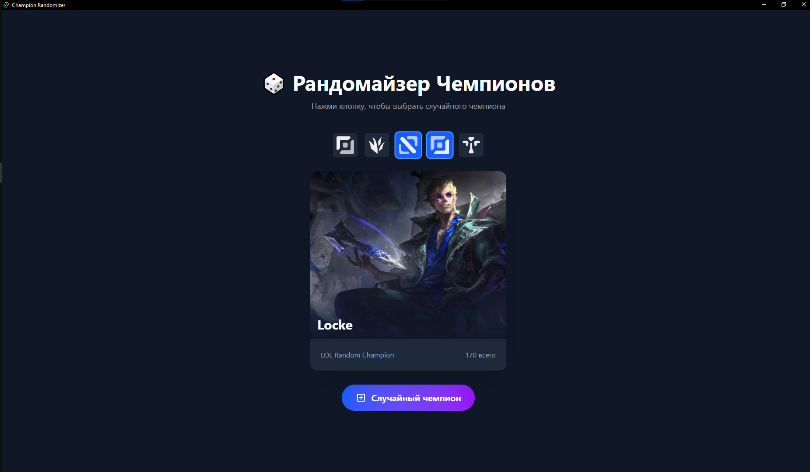

# 🎲 LOL Champions Randomizer

<div align="center">


**Randomizes ADC champions for League of Legends**

[](https://opensource.org/licenses/MIT)

</div>

---

## 📖 Описание

Приложение для случайного выбора чемпиона (ADC) в League of Legends. Мне было безумно скучно гриндить скилл на одном чампике по-долгу, поэтому я решил создать этот рандомайзер, дабы не думать иной раз, на ком мне сыграть.

### ✨ Возможности

- 🎲 Случайный выбор чемпиона с анимацией
- Возможность открыть гайд и билды на чемпиона (opgg)
- Кроссплатформенность (Windows, macOS, Linux)
- Фильтрация выбора чемпионов по ролям
- ⚡ Быстрая работа благодаря Tauri

## 📸 Скриншоты

<div align="center">
  
</div>

## 🚀 Быстрый старт

### Требования

- [Node.js](https://nodejs.org/) (версия 18 или выше)
- [Rust](https://rustup.rs/) (последняя стабильная версия)

### Установка

1. **Склонируй репозиторий**
   ```bash
   git clone https://github.com/po14rity/lol-champions-randomizer.git
   cd lol-champions-randomizer
   ```

2. **Установи зависимости**
   ```bash
   npm install
   ```

3. **Запусти в режиме разработки**
   ```bash
   npm run tauri dev
   ```

4. **Собери релизную версию**
   ```bash
   npm run tauri build
   ```

## Структура проекта

```
lol-champions-randomizer/
├── src/                    # Исходный код React
│   ├── assets/            # Изображения чемпионов
│   ├── App.tsx            # Главный компонент
│   └── main.tsx           # Точка входа
├── src-tauri/             # Rust бэкенд Tauri
│   ├── src/
│   │   └── main.rs        # Главный файл Rust
│   └── tauri.conf.json    # Конфигурация Tauri
├── public/                # Статические файлы
└── package.json           # Зависимости Node.js
```

## 🎯 Планы на будущее

- Расширить пулл чемпионов на другие роли
- Добавить фильтры по ролям (Tank, Mage, Assassin и т.д.)
- Звуковые эффекты при рандомизации
- Темная/светлая тема

## 🤝 Contributing

Contributions are welcome! Feel free to open issues and pull requests.

1. Fork the project
2. Create your feature branch (git checkout -b feature/AmazingFeature)
3. Commit your changes (git commit -m 'Add some AmazingFeature')
4. Push to the branch (git push origin feature/AmazingFeature)
5. Open a Pull Request

## 📄 License
Distributed under the MIT License. See LICENSE for more information.

## 👤 Автор

po14rity
- GitHub: [@po14rity](https://github.com/po14rity)

## 🙏 Благодарности

- [Tauri](https://tauri.app/) - за отличный фреймворк
- [Riot Games](https://www.riotgames.com/) - за League of Legends
- [League of Legends](https://op.gg) OPGG - за информацию о чемпионах

---

<div align="center">
<strong>Made with ❤️ by po14rity</strong>
<p>From Fans For Fans</p>
</div>

---

<div align="center">


</div>